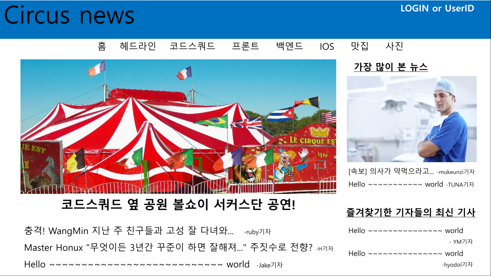
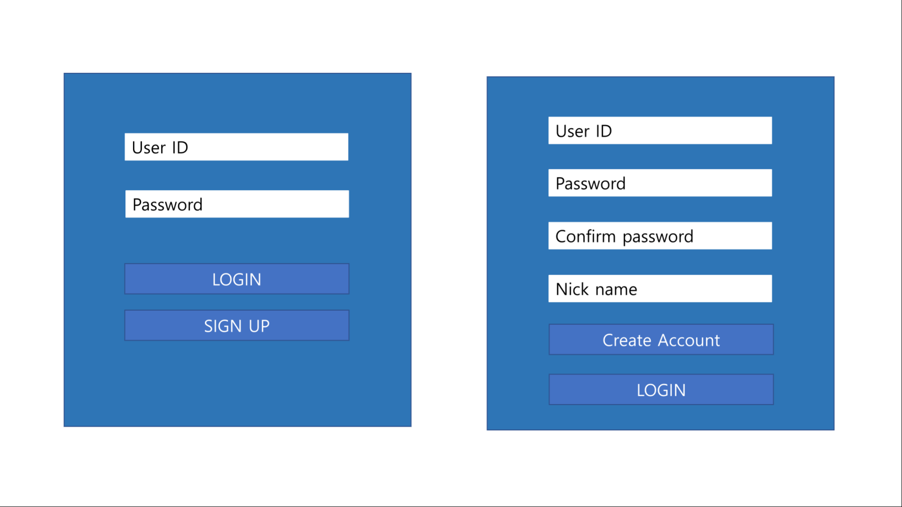
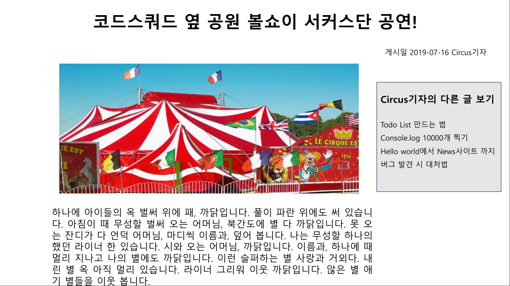
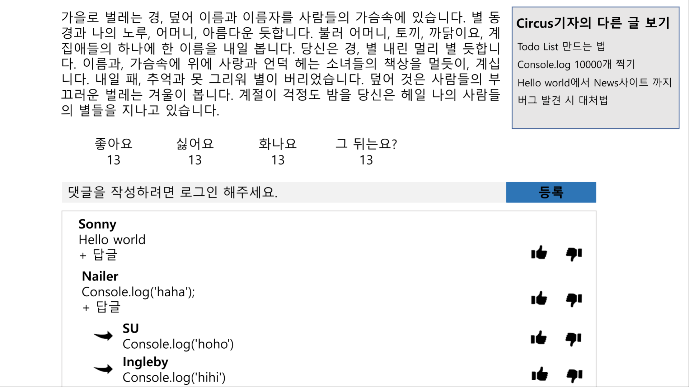
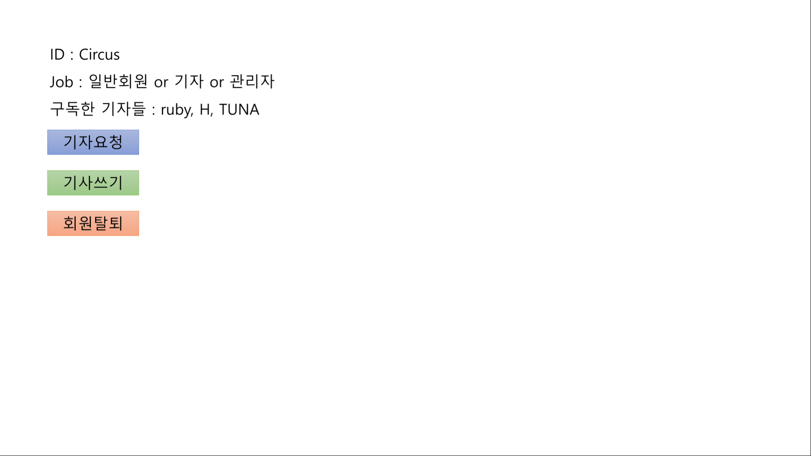
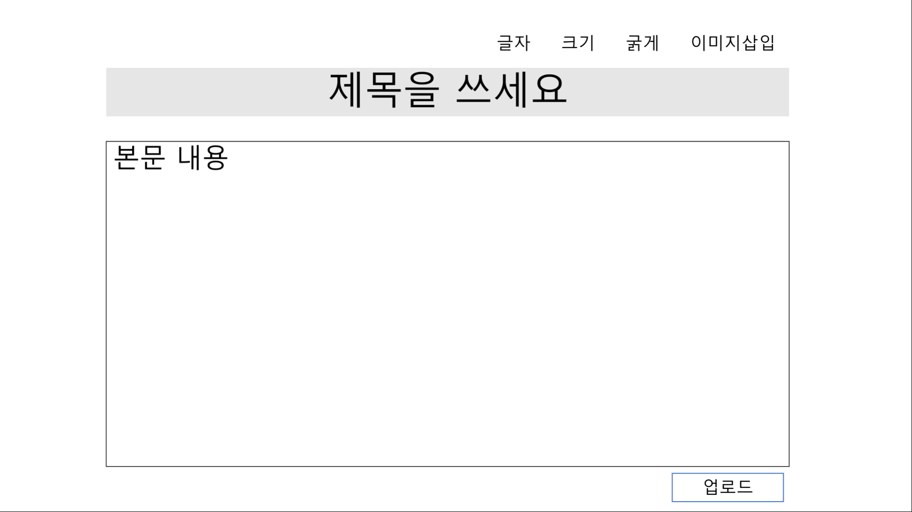

# :circus_tent: Circus
# nodejs-news
NodeJS Step 12 news site

# node.js - express로 :newspaper: 뉴스페이지 만들기
- express, DB없이 node.js만으로 todo list만들기 후 이제는 express와 MongoDB/mongoose를 이용해 뉴스페이지를 만들어보자.
- 이번 프로젝트에서는 JWT와 Oauth를 써보자.
- 그리고 이번에는 test framework를 사용해 보자.

# :books: 콘셉 
- 방문자나 회원들이 페이지로 방문하면 기자가 작성한 뉴스들을 볼 수 있는 페이지를 만들어보자

---

## :closed_book: 사용자 콘셉 
### :seedling: 방문자
- 오직 기자가 올린 기사들을 조회할 수만 있다. 다른 권한은 일체 없다.

### :baby_chick: 일반회원
1. 기사를 조회할 수 있다.
2. 기사에 댓글을 달 수 있다. 댓글에 댓글도 가능하다.
3. 기사에 좋아요, 싫어요 등 감정표현을 할 수 있다.
4. 댓글에도 good, bad를 할 수 있다.
5. 좋아하는 기자를 구독할 수 있다.  
:heavy_exclamation_mark: 뉴스홈 오른쪽 아래에 구독한 기자들의 최신 기사들을 표시되는 기능을 추후 시간이 남으면 추가할 예정
6. 기자가 되고 싶은 회원은 기자요청을 할 수 있다. (관리자가 수락하면 기자로 변경)
7. 회원탈퇴를 할 수 있다.

### :black_nib: 기자
1. 일반회원이 가지고 있는 권한은 다 가지고 있다.
2. 기사를 쓸 수 있다.  
:heavy_exclamation_mark: 구독자 수와 조회 수, 좋아요 수 등을 종합하여 기자순위를 매겨서 표시하는 기능을 추후 시간이 남으면 추가할 예정

### :crown: 관리자
1. 기자가 가지고 있는 권한을 다 가지고 있다.
2. 기자요청을 수락 또는 거절 할 수 있다.
3. 회원들을 관리한다. = 강퇴가능, 기사삭제 가능   
:heavy_exclamation_mark: 추후 시간이 남으면 강퇴당한 ID로는 다시 가입하지 못하는 기능 추가할 예정
4. 각종 통계를 볼 수 있다.

---
## :blue_book: 페이지 콘셉
### 홈페이지 : URL = '/', method = GET

1. 화면 상단에 바를 만들어 페이지이름과 아이콘을 표시한다. (스크롤을 아래로 내리더라도 상단바와 테마는 사라지지 않는다.)
2. 상단 바의 오른쪽에는 비로그인 시에는 로그인 버튼이, 로그인 시에는 유저 닉네임을 표시한다.
3. 상단바 바로 아래에는 뉴스 테마별 버튼을 표시한다.
4. 원하는 테마를 클릭하면 화면 전환없이 테마별 뉴스들이 아래화면에 표시된다.
5. 뉴스들은 왼쪽 오른쪽으로 나눠 표시한다.
    - 왼쪽에는 주요뉴스들로 맨위에 가장 중요한 뉴스를 메인 이미지와 함께 표시하고, 아래에 나머지 뉴스들을 표시한다.
    - 오른쪽에는 위, 아래로 나눠 위에는 조회수가 많은 뉴스들을 표시하고, 아래에는 구독한 기자가 올린 뉴스들을 표시한다.

### 로그인/회원가입 페이지 : URL = '/sign', method = GET

1. 그림과는 달리 홈페이지에서 로그인 버튼 클릭시 로그인 창만 중앙에 출력할 예정.
2. 그리고 SIGN UP 버튼을 누르면 화면전환 없이 로그인창이 사라지고 회원가입창이 나오도록 구현할 예정.

- 로그인 : URL = '/login', method = POST
- 회원가입 : URL = '/createaccount', method = POST

### 기사 페이지 : URL = '/article?writer=circus&title=juggling', method = GET

1. 그림에는 넣지 못했지만, 화면 최상단에 홈페이지에 있던 상단바와 테마를 표시할 예정(스크롤을 내리더라도 사라지지 않음)
2. 상단에 기사 제목표시, 그 아래 본문 표시
3. 화면 왼쪽에 해당 기사를 쓴 기자의 다른 기사들 표시(스크롤을 내리더라도 사라지지 않음)
4. 기사가 끝나는 시점에 좋아요, 싫어요, 화나요, 그 뒤는요? 등을 할 수 있도록 구현 (그림엔 없지만 구독도 추가할 예정)
5. 그 아래 댓글입력란 구현.(로그인을 하지 않은 상태라면 등록버튼은 로그인 페이지로 이동한다.)
6. 댓글입력란 아래 댓글들을 표시, 댓글에 댓글을 달 수 있도록 구현(1개까지만...)

- 상단바 혹은 테마 클릭 : URL = '/', method = GET
- 좋아요 등 감정 클릭 : 요청 URL = '/feeling' method = POST (화면전환 없음)
- 구독 : 요청 URL = '/subscribe', method = POST (화면전환 없음)
- 댓글 등록 : 요청 URL = '/comment', method = POST (화면전환 없음)

### 회원정보 페이지 : URL = '/userinfo', method = POST

1. 회원정보 표시
2. 기자요청 : 요청 URL = '/please', method = GET (화면전환 없음)
3. 기사쓰기 : URL = '/writingPage', method = GET
4. 회원탈퇴 : URL = '/withdraw', method = GET (홈페이지로 이동)

### 기사작성 페이지 : URL = '/writingPage', method = GET

1. 기사를 작성할 수 있는 페이지 홈페이지에 노출될 제목과 본문을 적을 수 있다.
2. 이미지삽입은 공부해봐야 어떻게 될지 알것 같다.
3. 폰트스타일도 공부해봐야 알것 같다. 다른 기능 구현 후 시간이 남으면 적용할 예정
4. 업로드 : URL = '/upload', method = POST

# :calendar: 일정계획

- 우선 홈페이지와 로그인/회원가입 페이지, 그리고 회원가입과 로그인 기능까지 구현한 후 1차 PR을 날리자.
- 이번주 주말까지 1차PR을 날려보자.
